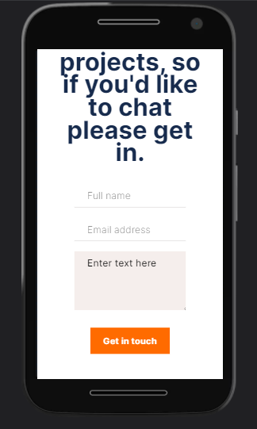

# Portfolio - Desktop and mobile app

> This webpage is made for cr training practice.

## Built With

- css
- html

## Authors

👤 **David Alvarez**

- GitHub: [@petudeveloper](https://github.com/petudeveloper)
- Twitter: [@petudeveloper](https://twitter.com/petudeveloper)
- LinkedIn: [David Alvarez Mazzo](https://www.linkedin.com/in/davidalvarezmazzo/)

## 🤝 Contributing

Contributions, issues, and feature requests are welcome!

Feel free to check the [issues page](../../issues/).

## Show your support

Give a ⭐️ if you like this project!

## Acknowledgments

- Hat tip to anyone whose code was used
- Inspiration
- etc

## 📝 License

This project is [MIT](./MIT.md) licensed.
